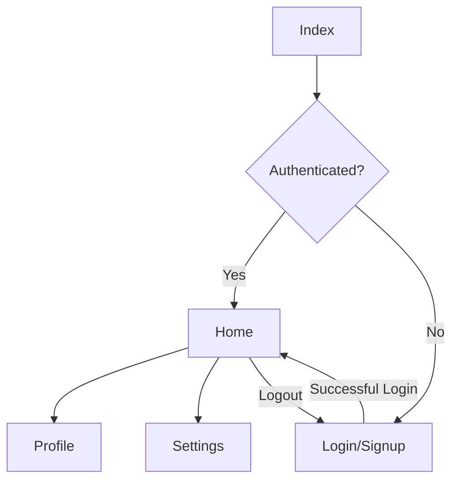

# Home Page Implementation Plan

## 1. Home Page Design and Components

- Create a new file: 'app/home.tsx'
- Components to include:
  * Header with user information and logout button
  * Dashboard summary (e.g., recent activity, notifications)
  * Quick action buttons (e.g., create new post, view profile)
  * Feed or main content area
  * Navigation footer (if needed)

## 2. Navigation Flow Updates

- Update 'app/login.tsx':
  * Modify handleLogin function to navigate to the home page on successful login
  * Use router.replace instead of router.push to prevent going back to the login page
- Update 'app/_layout.tsx':
  * Implement a stack navigator to manage authentication flow
  * Create separate stacks for authenticated and unauthenticated routes
- Update 'app/index.tsx':
  * Add a check for user authentication status
  * Redirect to home page if user is already logged in

## 3. Data Management Considerations

- Implement a global state management solution (e.g., Context API or Redux) to store user information and authentication status
- Create actions and reducers for login, logout, and updating user information
- Use the global state to determine which screens to show (authenticated vs. unauthenticated)

## 4. Security Considerations

- Implement token-based authentication (e.g., JWT)
- Store authentication tokens securely (e.g., using Expo SecureStore)
- Add an authentication header to API requests
- Implement token refresh mechanism to handle token expiration

## 5. Additional Features for Future Implementation

- User profile page
- Settings page
- Search functionality
- Notifications system

## Navigation Flow Diagram

This plan provides a structured approach to implementing the home page and updating the navigation flow. It considers not only the immediate task of creating a home page but also the broader implications for the app's architecture, including data management and security.